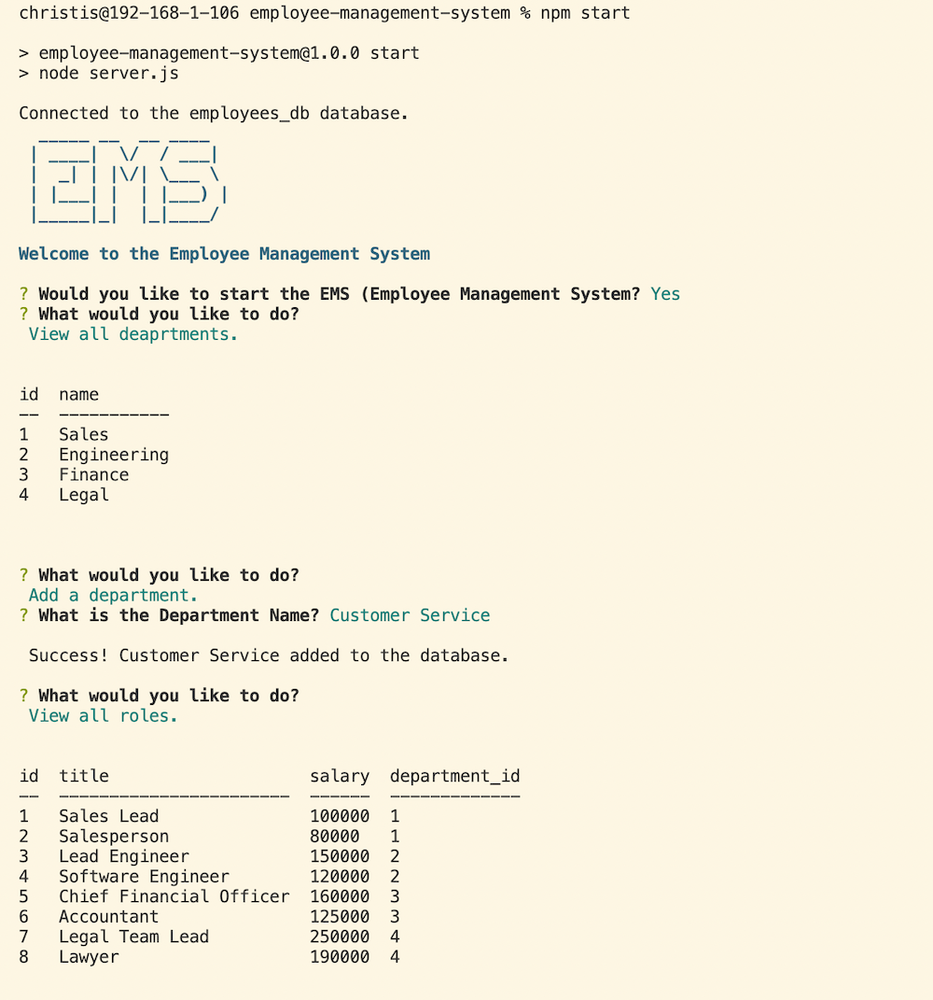

# Employee Management System

A command-line Employee Management System that allows users to create, manage and maintain their employee database. This application allows a user to: view and add departments, view and add roles, view and add employees, update employee role and delete an employee.

Future features could include the ability to delete roles and departments, update roles and departments and include a department budget.

## Table of Contents

* [Technologies](#technologies)
* [Installation](#installation)
* [Usage](#usage)
* [Live Demo](#live-demo)
* [Resources](#resources)
* [License](#license)

## Technologies
This application was built using the following technologies and languages:
* [Node.js](https://nodejs.org/en/)
* [Inquirer](https://www.npmjs.com/package/inquirer)
* [MySQL 2 NPM](https://www.npmjs.com/package/mysql2)
* [dotenv NPM](https://www.npmjs.com/package/dotenv)
* [Figlet NPM](https://www.npmjs.com/package/figlet)
* [Console.table NPM](https://www.npmjs.com/package/console.table)
* JavaScript
* SQL

## Installation

To run the Employee Management System, you'll first need to clone the [employee-management-system repo on GitHub](https://github.com/jazzberriess/employee-management-system) or download the zipfile, then install node.js, the inquirer package and other dependencies.

To install the dependencies included in this repo, navigate to the root directory of the cloned or downloaded repo. In either your terminal, command line or using the integrated terminal in your code editor of choice, enter the following command:

`npm i`

OR

`npm install`

If you're including the `package-lock.json` file from this repo in your own files, then run the following command instead:

`npm ci`

## Usage

To use the Employee Management System , clone or download the repo and install the dependencies as instructed above.

Next, enter the following command in either your terminal, command line or using the integrated terminal in your code editor of choice:

`npm start`

Then, answer the prompts.

Responses will be printed in the terminal.

## Live Demo
### [Video demonstration of the application being used](https://drive.google.com/file/d/17jO5wutyJETD72RNoZlQsHjpnQ36mgR2/view) in the integrated terminal in VS Code.

### Screenshot of the splash page and one of the resposnes:

## Resources
* [Inquirer Documentation](https://github.com/SBoudrias/Inquirer.js#readme)
* [MDN Docs - JavaScript](https://developer.mozilla.org/en-US/docs/Web/JavaScript/Reference)
* [MySQL Tutorial](https://www.mysqltutorial.org/)
* [SQLZoo](https://sqlzoo.net/wiki/SQL_Tutorial)
* [What is a self-join in SQL](https://learnsql.com/blog/what-is-self-join-sql/)
* [How to Learn SQL Joins](https://learnsql.com/blog/learn-and-practice-sql-joins/)
* [Everything you ever wanted to know about ANSI excape codes](https://notes.burke.libbey.me/ansi-escape-codes/)
* [Bash tips: Colors and formatting](https://misc.flogisoft.com/bash/tip_colors_and_formatting)
* Class notes and recordings
* Ask BCS

## License

This project is covered under the [MIT license](https://github.com/jazzberriess/employee-management-system/blob/main/LICENSE)

&copy; 2022 Christi Scappatura